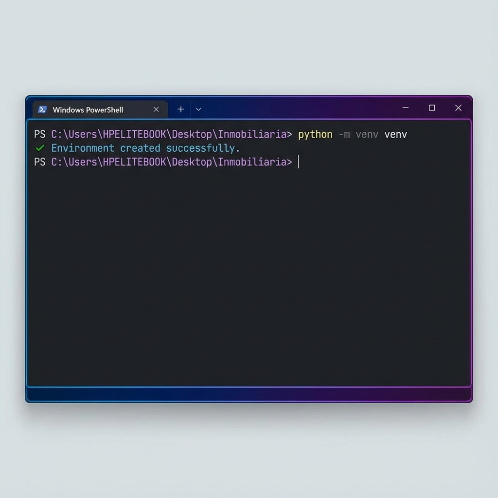
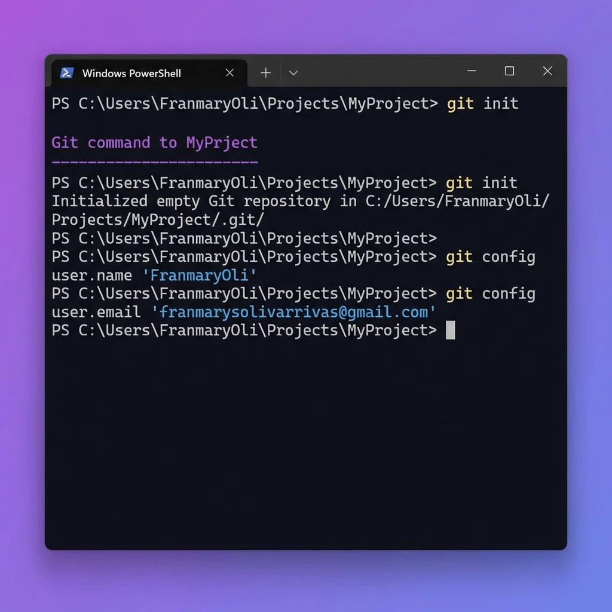
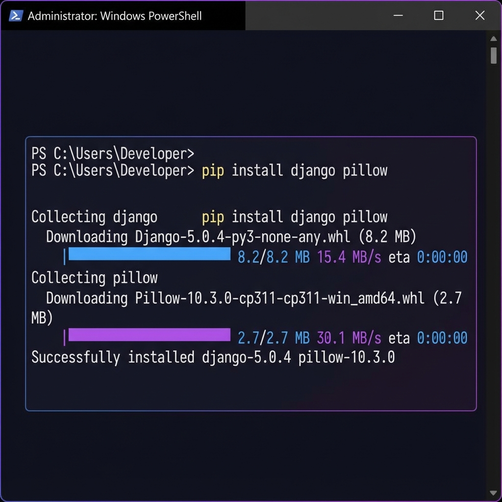
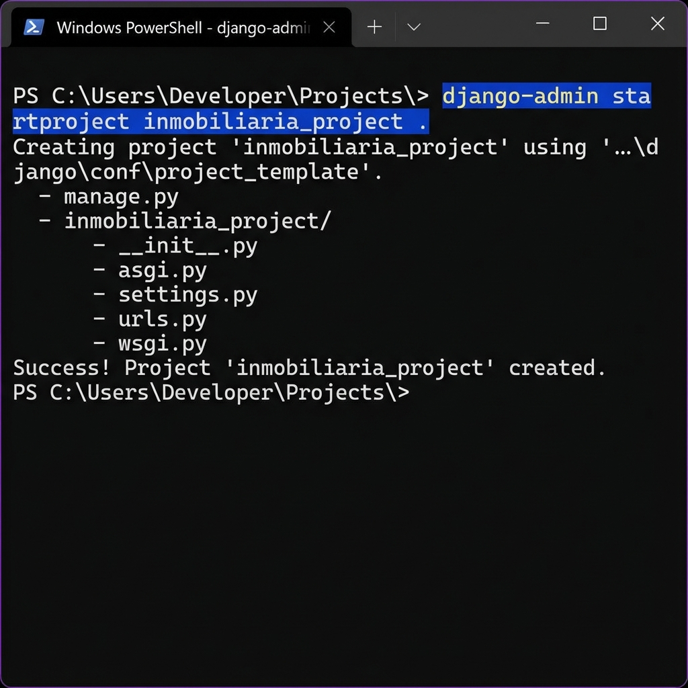
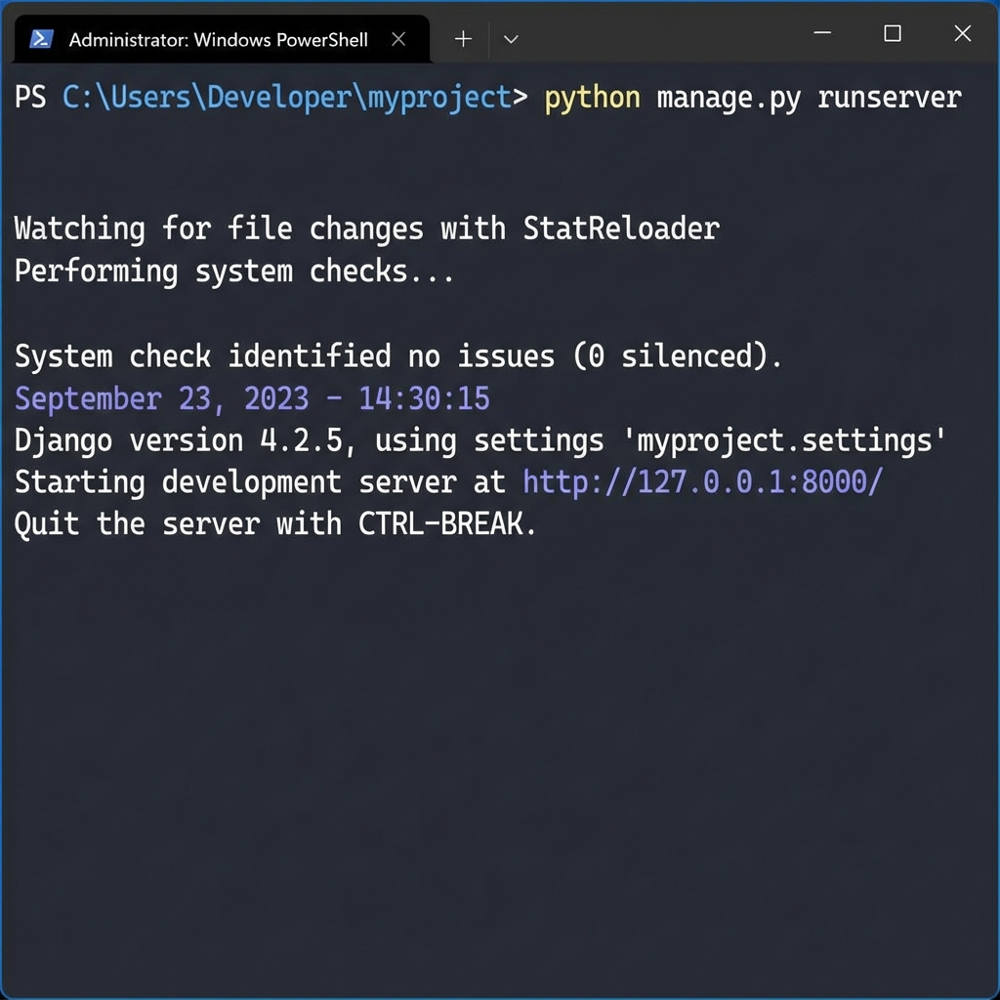

# Sistema Inmobiliario - Módulo 1 Django

## 📋 Descripción del Proyecto

Sistema web de gestión inmobiliaria desarrollado con Django como parte del Módulo 1 de Desarrollo de Aplicaciones Web. Este proyecto permite administrar propiedades, tipos de propiedades y ubicaciones a través de una interfaz web moderna y un panel de administración completo.

## 🚀 Características Implementadas

### A. Herramientas Instaladas
- Python 3.13.7
- Django 5.2.8
- Pillow (para manejo de imágenes)

### B. Entorno Virtual
- Entorno virtual creado con `venv`
- Dependencias aisladas del sistema



### C. Control de Versiones
- Repositorio Git inicializado
- Archivo `.gitignore` configurado
- Conectado a GitHub



### D. Framework Django
- Django instalado y configurado
- Proyecto: `inmobiliaria_project`
- Aplicación: `propiedades`



### E. Proyecto Django
- Configuración en español (es-ve)
- Zona horaria: America/Caracas
- Base de datos SQLite3



### F. Aplicación Web
- Aplicación `propiedades` creada y registrada
- Configuración de archivos media para imágenes

### G. Modelos Creados

#### 1. TipoPropiedad
- Nombre
- Descripción

#### 2. Ubicacion
- Ciudad
- Estado
- Zona
- Dirección

#### 3. Propiedad (Modelo Principal)
- Título
- Descripción
- Tipo (ForeignKey)
- Ubicación (ForeignKey)
- Precio
- Área en metros cuadrados
- Habitaciones
- Baños
- Estacionamientos
- Estado (Disponible, Vendida, Alquilada, Reservada)
- Imagen
- Destacada
- Fechas de publicación y actualización

### H. Django Admin Configurado
- Panel de administración personalizado
- Filtros y búsquedas avanzadas
- Campos editables en línea
- Organización por fieldsets

### I. Sistema de Templates
- Template base con diseño moderno
- Gradientes y efectos visuales
- Diseño responsive
- Navegación intuitiva

### J. Vistas Implementadas

#### Lista de Propiedades
- Muestra todas las propiedades en formato grid
- Filtros por tipo y estado
- Contador de resultados
- Tarjetas con información resumida
- Badge para propiedades destacadas

#### Detalle de Propiedad
- Información completa de la propiedad
- Características detalladas
- Ubicación completa
- Fechas de publicación

## 📁 Estructura del Proyecto

```
Inmobiliaria/
├── inmobiliaria_project/
│   ├── settings.py
│   ├── urls.py
│   └── wsgi.py
├── propiedades/
│   ├── migrations/
│   ├── templates/
│   │   └── propiedades/
│   │       ├── base.html
│   │       ├── lista_propiedades.html
│   │       └── detalle_propiedad.html
│   ├── admin.py
│   ├── models.py
│   ├── views.py
│   └── urls.py
├── venv/
├── manage.py
├── .gitignore
└── README.md
```

## 🛠️ Instalación y Uso

### 1. Clonar el repositorio
```bash
git clone <URL_DEL_REPOSITORIO>
cd Inmobiliaria
```

### 2. Crear y activar entorno virtual
```bash
python -m venv venv
.\venv\Scripts\activate  # Windows
```

### 3. Instalar dependencias
```bash
pip install django pillow
```

### 4. Realizar migraciones
```bash
python manage.py migrate
```

### 5. Crear superusuario
```bash
python manage.py createsuperuser
```

### 6. Ejecutar servidor de desarrollo
```bash
python manage.py runserver
```



### 7. Acceder a la aplicación
- Sitio web: http://127.0.0.1:8000/
- Panel admin: http://127.0.0.1:8000/admin/

## 🎨 Características de Diseño

- **Colores**: Gradiente púrpura (#667eea a #764ba2)
- **Efectos**: Glassmorphism, sombras suaves
- **Tipografía**: Segoe UI
- **Responsive**: Diseño adaptable a diferentes pantallas
- **Animaciones**: Transiciones suaves en hover
- **Iconos**: Emojis para mejor UX

## 📊 Funcionalidades del Admin

- Gestión completa de propiedades
- Filtros por estado, tipo y fecha
- Búsqueda por título, descripción y ubicación
- Edición rápida de estado y destacado
- Organización por secciones (Información Básica, Características, Estado)

## 👨‍💻 Autor

Proyecto desarrollado como parte del Módulo 1 de Desarrollo de Aplicaciones Web

## 📝 Licencia

Proyecto educativo - 2025
